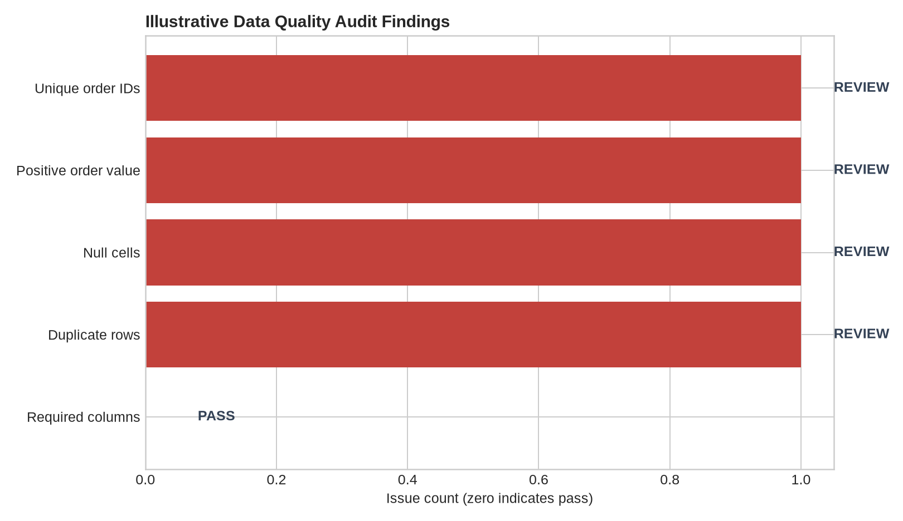
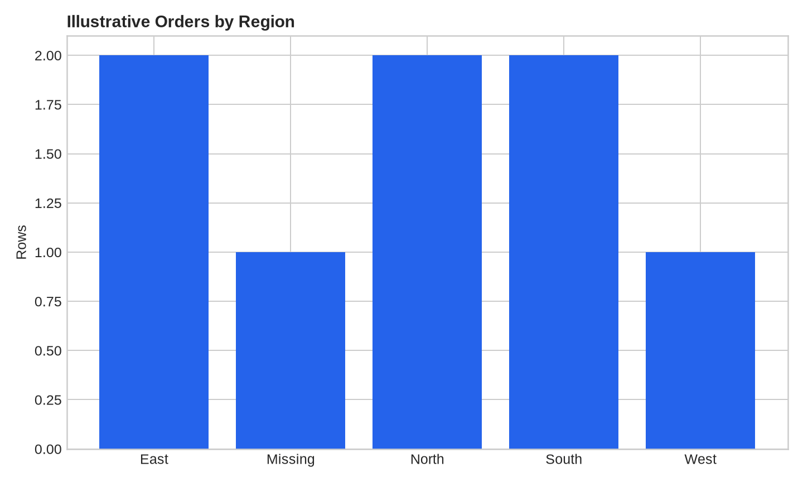

# Data Quality Audit Toolkit

> Reusable validation layer for analytics datasets covering schema, nulls, duplicates, ranges, business rules, and KPI reconciliation.

## Business Problem

A dashboard or report is only as trustworthy as the data feeding it. The toolkit turns common analytical failure modes into repeatable pre-publication controls.

## Analytical Questions

- Are required fields present and correctly typed?
- How much missingness or duplication exists?
- Do business rules and ranges hold?
- Do source totals reconcile to reporting totals?
- Which failures can materially change KPIs?

## Deliverables

- Schema checks
- Missingness report
- Duplicate detection
- Range and business-rule tests
- Referential-integrity checks
- Source-to-report reconciliation
- Pass/review/fail summary

## Suggested Repository Structure

```text
data-quality-audit-toolkit/
├── data/
├── notebooks/
├── src/
├── tests/
├── outputs/
├── README.md
└── requirements.txt
```

## Stack

Python, pandas, SQL, SQLite/DuckDB concepts, pytest

## Method

1. Define the decision context and metric definitions.
2. Profile and validate the data.
3. Build reproducible transformations and calculations.
4. Quantify the main drivers, scenarios, or failure modes.
5. Validate outputs and document limitations.
6. Produce an executive-ready decision narrative.

## Portfolio Standard

Use synthetic or public data with documented provenance. Clearly distinguish measured results from assumptions and illustrative scenarios.

## Sample Outputs

Run `python src/generate_outputs.py` to reproduce the illustrative data-quality audit. The fixture is deliberately imperfect synthetic order data so the toolkit demonstrates both PASS and REVIEW states.

### Executive summary

See [`outputs/audit_summary.md`](outputs/audit_summary.md) for findings, decision guidance, and limitations.





- [`outputs/audit_checks.csv`](outputs/audit_checks.csv) — check-level results
- [`outputs/audit_profile.csv`](outputs/audit_profile.csv) — profile summary
